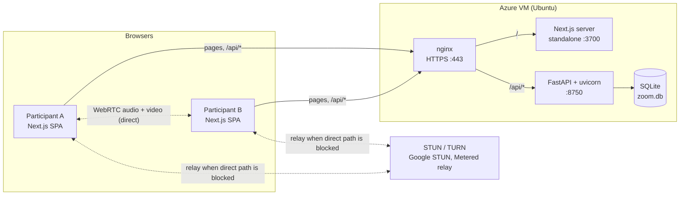
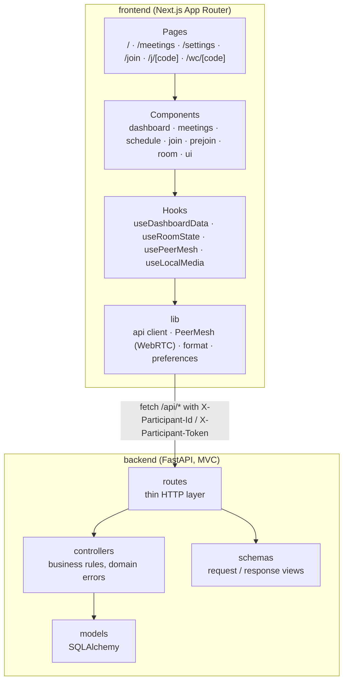
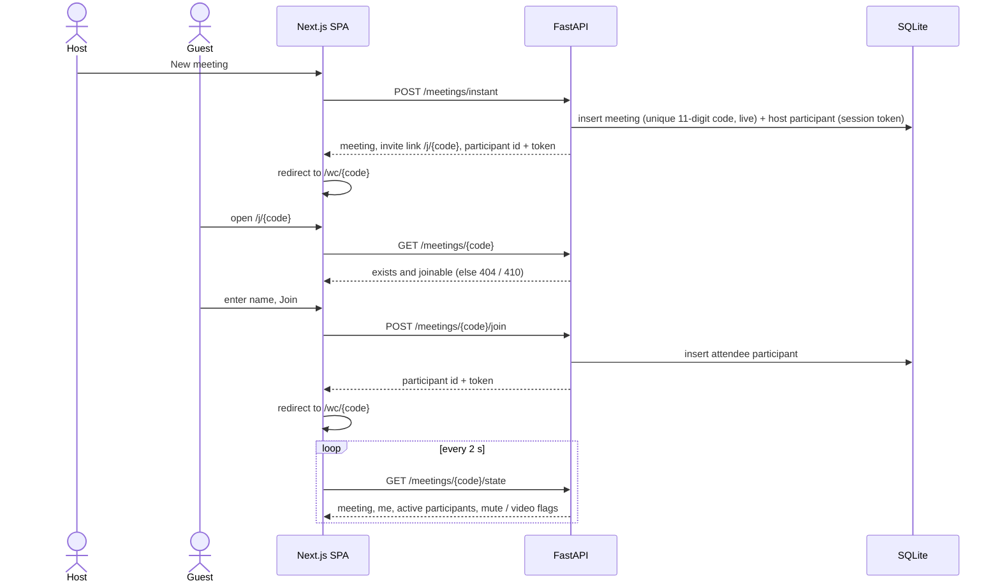
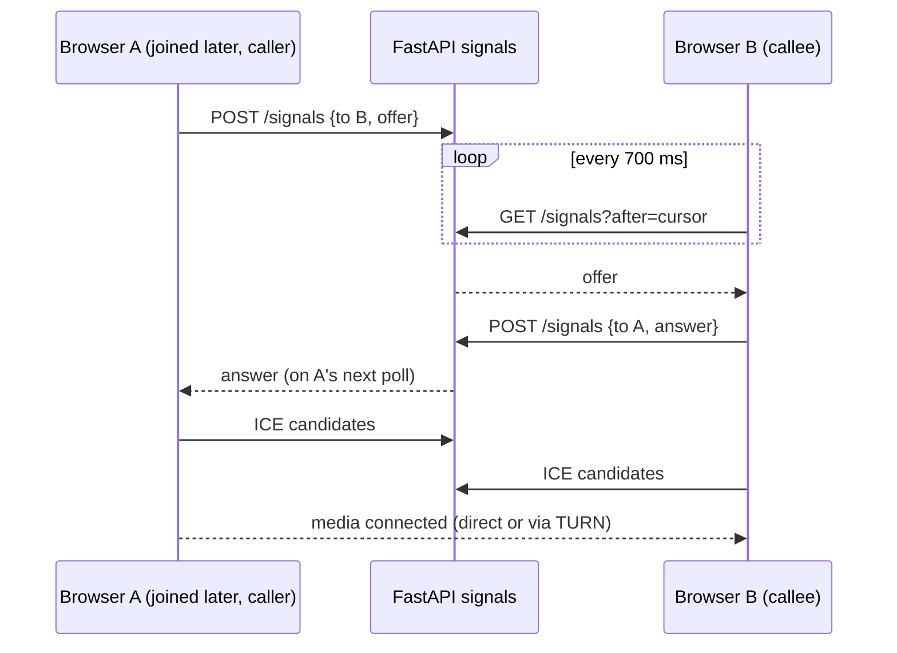
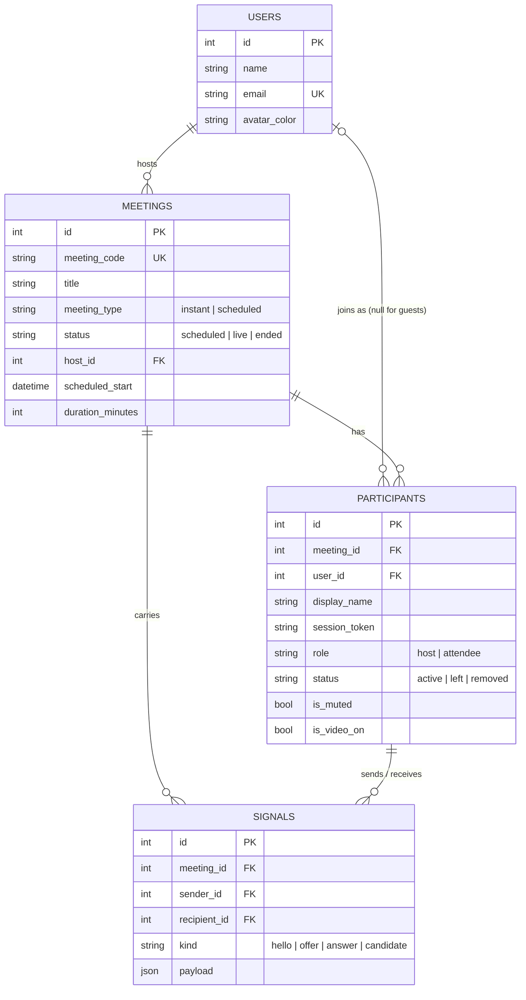
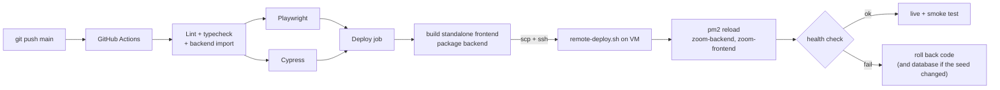

# Zoom Clone

A video conferencing web app modeled on the Zoom web client. You can start instant meetings, join by meeting ID or invite link, schedule meetings for later, and manage participants from inside the meeting room.

- **Live app:** https://lakshya-zoom.eastasia.cloudapp.azure.com
- **Repository:** https://github.com/Lakshya77089/zoom-clone

## Tech Stack

| Layer    | Tech                                              |
| -------- | ------------------------------------------------- |
| Frontend | Next.js 16 (App Router, TypeScript), Tailwind CSS 4 |
| Backend  | Python 3.10+, FastAPI, SQLAlchemy 2, Pydantic 2   |
| Database | SQLite                                            |

## Features

- **Dashboard**: Zoom Workplace style shell with a header (meeting search with `Ctrl+K`, profile menu) and a left navigation rail (Home, Meetings, Settings), plus New meeting / Join / Schedule actions, a live clock, upcoming meetings grouped by day, and recent meetings. Each meeting card shows the time, duration and meeting ID, a Start / Join button, and a menu to copy the invitation, invite link or meeting ID, or delete a scheduled meeting.
- **Meetings page**: Upcoming and Previous tabs with search by topic or meeting ID, and a detail panel with Start / Join, Copy Invitation, Delete, the invite link and the full invitation text.
- **Settings page**: Zoom-style settings with General, Audio, Video and My account sections. The preferences (join muted, join with video off, show invite details when starting a meeting) are stored in the browser, and My account is the profile placeholder for the seeded user. The Join dialog and pre-join screen can also remember your display name.
- **Instant meeting**: generates a unique 11-digit meeting ID and a shareable invite link (`/j/<meeting id>`), then takes the host straight into the room.
- **Join meeting**: accepts a meeting ID (with or without spaces) or a full invite link, from the Join dialog or the standalone `/join` page. You enter a display name first, and the meeting's existence is checked before joining. Each field shows its own error (invalid ID, meeting not found, meeting ended, missing name). Invite links open a pre-join screen with a camera and mic preview.
- **Schedule meeting**: topic, description, date and time pickers, and duration. The meeting ID and link are generated automatically, the meeting is stored in SQLite, and it appears under Upcoming meetings. After saving you can copy the invitation.
- **Meeting room**: live video and audio between all participants over WebRTC, mute and video toggles, participant grid, participants panel, a More menu (copy invite link, invitation or meeting ID, and mute all for the host), meeting info with a copy-link button, and leave / end meeting.
- **Host controls**: mute all, remove a participant, and end the meeting for everyone. If the host leaves, host is passed to the next participant.
- **Responsive**: works on mobile, tablet and desktop. Dialogs fit the screen, and the meeting toolbar keeps Audio, Video, Participants, More and End/Leave on small phones.

## High-Level Design

### System architecture



- **Control plane** (meetings, participants, host actions, WebRTC signaling) goes through the REST API and is stored in SQLite.
- **Media plane** (audio and video) never touches the server. It flows browser to browser over WebRTC, or through a TURN relay when the networks can't reach each other directly.
- The browser only talks to its own origin. nginx (or the Next.js `/api` proxy in development) forwards `/api/*` to FastAPI, so there are no CORS issues and a single exposed port is enough.

### Components



### Key flows

**Start an instant meeting and join by invite link**



**WebRTC signaling (polling mailbox)**



- In each pair the participant with the higher id (the one who joined later) sends the offer, so both sides never offer at the same time.
- A participant who reloads sends `hello`, and the other side calls again. Calls that don't connect within 20 seconds are retried.
- Reading with `after=cursor` also deletes the rows already processed, so the `signals` table stays small. A meeting's signals are removed when it ends.

### Data model



### Deployment and CI/CD



### Design decisions

| Decision | Why | Trade-off |
|---|---|---|
| FastAPI with an MVC split (routes, controllers, schemas, models) | Business rules live in one place; routes stay thin and testable | A little more boilerplate per endpoint |
| SQLite | Required by the assignment, zero setup, one file to back up | One writer at a time; fine for a single VM |
| REST polling for room state (2 s) and signaling (700 ms) | Works through nginx, the Next.js proxy and tunnels with nothing extra to run | More requests than WebSockets and up to 2 s delay for list updates |
| WebRTC full mesh, no media server | No media infrastructure to host or pay for, and lowest latency for small calls | Each browser uploads one video copy per participant, so calls stay small |
| TURN credentials served by `/api/rtc/ice-servers` | Secrets stay on the backend and can change without a frontend rebuild | One extra request when a room opens |
| Per-participant session token | Stops one participant acting as another (for example the host) by guessing an id | Tokens live in `sessionStorage`, so a new tab has to join again |
| Invite links built from the request origin | Links are correct on localhost, a tunnel or the real domain | Needs the `X-Public-Origin` header, with `FRONTEND_URL` as the fallback |

### Capacity and limits

| Limit | Value | Where it comes from |
|---|---|---|
| People on video in one meeting | about 4–5 comfortably, 6 on good connections | Full mesh: each person uploads N-1 video streams, so upload bandwidth and CPU run out |
| Audio-only meeting | about 10–15 | Audio streams are small |
| Concurrent participants across all meetings | about 50 with sub-second responses | Measured with a local load test: one uvicorn worker, SQLite, SQLAlchemy pool of 5 + 10 connections. At about 100 the pool is exhausted and requests time out |
| TURN relay usage | depends on the Metered plan | Only calls that can't connect directly use the relay, but each relayed stream counts against the quota |

To scale further: add a media server (SFU such as LiveKit or mediasoup) so each person uploads once, move signaling and room updates to WebSockets, run several uvicorn workers, and switch to PostgreSQL.

## Project Structure

```
backend/
  app/
    core/          config, database session, dependencies, error handlers, startup migrations
    models/        SQLAlchemy models (User, Meeting, Participant)
    schemas/       Pydantic request/response models
    controllers/   business logic
    routes/        FastAPI routers (thin HTTP layer)
    utils/         meeting-code generation, time helpers
    seed.py        sample data loaded on first start
    main.py        app entrypoint
frontend/
  src/
    app/           routes: / (dashboard), /meetings, /settings, /join, /j/[code] (pre-join), /wc/[code] (meeting room)
    components/    ui, layout, dashboard, meetings, join, schedule, settings, prejoin, room
    constants/     routes, navigation, limits and shared messages
    hooks/         data fetching, polling, media, clipboard, preferences
    lib/           API client, formatting, meeting-code parsing, preferences
    types/         shared TypeScript types
  tests/e2e/       Playwright specs
  cypress/         Cypress specs and support commands
  scripts/         test server setup shared by both suites
```

The backend follows an MVC split. **Models** hold the schema, **schemas** are the views that shape API input and output, and **controllers** hold all business rules. Routes only wire HTTP to controllers. Controllers raise domain errors (`NotFoundError`, `ForbiddenError`, `MeetingEndedError`, …), and one handler turns them into HTTP responses.

## Database Schema

```
users
  id PK, name, email UNIQUE, avatar_color, created_at

meetings
  id PK, meeting_code UNIQUE (11 digits), title, description,
  meeting_type (instant | scheduled), status (scheduled | live | ended),
  host_id FK -> users.id (CASCADE),
  scheduled_start, duration_minutes, started_at, ended_at, created_at
  INDEX (host_id, status)

participants
  id PK, meeting_id FK -> meetings.id (CASCADE), user_id FK -> users.id (SET NULL, nullable for guests),
  display_name, session_token, role (host | attendee), status (active | left | removed),
  is_muted, is_video_on, joined_at, left_at
  INDEX (meeting_id, status)

signals
  id PK AUTOINCREMENT, meeting_id FK -> meetings.id (CASCADE),
  sender_id FK -> participants.id (CASCADE), recipient_id FK -> participants.id (CASCADE),
  kind (hello | offer | answer | candidate), payload JSON, created_at
  INDEX (recipient_id, id)
```

- A user hosts many meetings, and a meeting has many participants.
- Participants are separate rows for each join, so meeting history (who joined, when, and whether they left or were removed) is kept.
- The invite link is not stored. The API builds it from the address the app was opened on (the frontend sends it in an `X-Public-Origin` header) and the meeting code, so links stay correct on localhost, behind a tunnel, or on a deployed domain. `FRONTEND_URL` is the fallback.
- All timestamps are stored in UTC and returned as ISO 8601 strings with a `Z` suffix.
- `signals` is a short-lived WebRTC signaling mailbox. Each participant reads the rows addressed to them with an `after` cursor, which also deletes the rows they have already processed. `AUTOINCREMENT` keeps ids increasing after deletes, so the cursor never skips a message. All of a meeting's signals are deleted when it ends.

## API

Base URL: `/api`. Interactive docs are at `/docs` once the backend is running.

| Method | Endpoint | Description |
| ------ | -------- | ----------- |
| GET    | `/users/me` | Current (default) user |
| GET    | `/meetings/upcoming` | Scheduled meetings that haven't finished yet |
| GET    | `/meetings/recent` | Meetings the user has hosted that have started |
| POST   | `/meetings/instant` | Create and start an instant meeting |
| POST   | `/meetings` | Schedule a meeting |
| GET    | `/meetings/{code}` | Check that a meeting exists and can be joined |
| DELETE | `/meetings/{code}` | Host deletes a scheduled meeting that has not started |
| POST   | `/meetings/{code}/start` | Host starts or rejoins a meeting |
| POST   | `/meetings/{code}/join` | Join with a display name |
| POST   | `/meetings/{code}/end` | Host ends the meeting for everyone |
| GET    | `/meetings/{code}/state` | Room state: meeting, self, active participants |
| GET    | `/meetings/{code}/participants` | Active participants |
| PATCH  | `/meetings/{code}/participants/{id}` | Update own mute/video state |
| POST   | `/meetings/{code}/participants/{id}/leave` | Leave the meeting |
| POST   | `/meetings/{code}/participants/mute-all` | Host mutes everyone else |
| DELETE | `/meetings/{code}/participants/{id}` | Host removes a participant |
| POST   | `/meetings/{code}/signals` | Send a WebRTC signal (offer, answer, ICE candidate, hello) to another participant |
| GET    | `/meetings/{code}/signals?after={id}` | Get signals addressed to you, acknowledging everything up to `after` |
| GET    | `/rtc/ice-servers` | STUN/TURN servers and ICE policy for the browser |

In-room actions identify the caller with two headers, `X-Participant-Id` and `X-Participant-Token`. Both come from the join/start response and are kept in the browser's `sessionStorage`. The token is a random secret that is only returned to the person who joined, so nobody can act as another participant (for example the host) by guessing their id. A wrong or missing token is rejected with 403/422. Databases created before the token existed get the column added on startup.

## Setup

### Backend

```bash
cd backend
python -m venv .venv
# Windows: .venv\Scripts\activate    macOS/Linux: source .venv/bin/activate
pip install -r requirements.txt
cp .env.example .env
uvicorn app.main:app --reload --port 8000
```

On first start the database is created and seeded with a default user (Alex Johnson), 6 upcoming meetings and 5 past meetings with participants. To reset, delete `zoom.db` and restart.

### Frontend

```bash
cd frontend
npm install
cp .env.example .env
npm run dev
```

Open http://localhost:3000.

### Environment Variables

| Variable | Where | Default |
| -------- | ----- | ------- |
| `DATABASE_URL` | backend | `sqlite:///./zoom.db` |
| `FRONTEND_URL` | backend (fallback base for invite links) | `http://localhost:3000` |
| `CORS_ORIGINS` | backend, comma separated | `http://localhost:3000` |
| `STUN_URLS` | backend, comma separated | Google public STUN |
| `TURN_URLS` | backend, comma separated TURN urls, e.g. `turn:host:3478,turns:host:443?transport=tcp` | empty |
| `TURN_USERNAME` / `TURN_CREDENTIAL` | backend, credentials for `TURN_URLS` | empty |
| `CLOUDFLARE_TURN_KEY_ID` / `CLOUDFLARE_TURN_API_TOKEN` | backend, generates short-lived Cloudflare TURN credentials | empty |
| `METERED_KEY_ID` / `METERED_SIGNING_SECRET` | backend, Metered secret key pair (`sk_id_…` / `sk_secret_…`); the backend signs a short-lived token locally and reads Metered's TURN servers from the welcome message | empty |
| `ICE_TRANSPORT_POLICY` | backend, `all` or `relay` (force every call through TURN) | `all` |
| `BACKEND_URL` | frontend, build time (target of the `/api` proxy) | `http://localhost:8000` |
| `NEXT_PUBLIC_API_URL` | frontend, optional (call the API directly instead of through the proxy) | empty |


The frontend calls the API on its own origin at `/api/*`, and Next.js forwards those requests to `BACKEND_URL`. The browser never makes a cross-origin request, so the app works behind port forwarding or a tunnel with only port 3000 exposed. Invite links automatically use whichever URL the app was opened on.

## Testing

Both suites live in `frontend` and run against their own servers: a backend on port 8100 with a separate `e2e.db`, and a production build of the frontend (in `.next-e2e`) on port 3100. They start automatically, and servers that are already running on those ports are reused. Your dev database is never touched.

```bash
cd frontend
npx playwright install chromium   # first run only
npm run test:e2e        # Playwright: flows, validation, meeting room, responsive checks, screenshots
npm run test:cypress    # Cypress: navigation, preferences, stubbed network states, full workflow
npm test                # both
```

- Set `E2E_BASE_URL` to run against an app that is already running (for example `E2E_BASE_URL=http://localhost:3000`). Nothing is started in that case.
- Playwright runs with a fake camera and microphone and saves screenshots of the dashboard, dialogs and meeting room to `test-results/screenshots`.
- The backend venv is expected at `backend/.venv`. Set `E2E_PYTHON` to use a different Python.

## Deployment

The app runs on a single Linux VM behind nginx, managed by PM2:

| Piece | Where |
|---|---|
| FastAPI backend | `127.0.0.1:8750` (uvicorn in `backend/.venv`, SQLite `zoom.db`) |
| Next.js frontend | `127.0.0.1:3700` (standalone build) |
| nginx | serves the domain, sends `/api/*` to the backend and everything else to the frontend |

Files in `deploy/`:

- `ecosystem.config.cjs`: PM2 apps `zoom-backend` and `zoom-frontend`
- `nginx.conf.template`: site config (replace `__DOMAIN__`, `__BACKEND_PORT__`, `__FRONTEND_PORT__`)
- `remote-deploy.sh`: unpacks a release, installs backend requirements, reloads PM2, health-checks both apps, and rolls back if either check fails

### CI/CD

`.github/workflows/ci-cd.yml` runs on every push and pull request:

1. **Lint and typecheck**: ESLint, TypeScript (app and Cypress), and an import check for the backend
2. **Playwright** and **Cypress** run in parallel against a fresh backend and a production build
3. **Deploy** (pushes to `main` or a manual run only): builds the frontend in standalone mode, packages it with the backend, copies it to the server over SSH, runs `remote-deploy.sh`, then smoke-tests the live URL

The deploy job reads these from the `production` environment:

| Name | Kind | Value |
|---|---|---|
| `DEPLOY_HOST` | secret | server IP |
| `DEPLOY_USER` | secret | SSH user |
| `DEPLOY_SSH_KEY` | secret | private key of a deploy-only SSH key authorized on the server |
| `DEPLOY_KNOWN_HOSTS` | secret | the server's `known_hosts` entry |
| `ZOOM_DOMAIN` | variable | public hostname |

One-time server setup: create `~/apps/zoom-clone/backend/.env` (`DATABASE_URL`, `FRONTEND_URL`, `CORS_ORIGINS`, TURN settings), install the nginx site from the template, and issue a certificate with `sudo certbot --nginx -d <domain>`. HTTPS is required because browsers only allow camera and microphone access on secure origins.

## Assumptions

- No login: a default seeded user (Alex Johnson) is always signed in, as the assignment allows.
- Anyone with a meeting ID or invite link can join after entering a name. The meeting must exist and not have ended.
- Joining a scheduled meeting before the host starts it makes the meeting live.
- A meeting ends when the host ends it for everyone or the last participant leaves. If the host leaves, the next participant becomes host. Ended meetings can't be rejoined.
- Scheduled meetings must start in the future and last 15 minutes to 24 hours. They use the browser's time zone, with no recurrence.

## Mocked / Sample Data

- On first start the database is seeded with 5 users, 6 upcoming meetings (placed relative to the current time) and 5 past meetings with participants.
- The profile (name, email, "Basic" plan) is a read-only placeholder for the seeded user.
- Settings (join muted, join with video off, show invite details, remember my name) are saved in the browser's `localStorage`.
- Zoom features outside the assignment (chat, reactions, share screen, record, apps, recordings, summaries, notes, and schedule options such as recurrence, passcode and waiting room) are greyed-out placeholders with a "not allowed" cursor that do nothing.

## Notes

- The UI follows measurements taken from the live Zoom web app (sizes, colours, spacing, font sizes) at 1440×900 and 390×844. Icons, the logo and the empty-state illustrations use the SVG geometry of the real Zoom web client, collected in `frontend/src/components/icons`; the typeface is the system font stack.
- Audio and video are real WebRTC between browsers and work best with up to about 5 people on video (see [Capacity and limits](#capacity-and-limits)).
- Google STUN is enough on normal home networks. Campus, office and mobile networks often need a TURN relay, configured with the `TURN_*`, Cloudflare or Metered variables; a `turns:…:443?transport=tcp` url gets through most firewalls.
- Remote tiles show "Connecting..." until media flows, and "Can't connect" if the two networks can't reach each other. Mute and video off disable the local tracks, so muted audio is silent for everyone.
- When the seed data changes, the deploy backs up the old database and reseeds it. To reset locally, delete `backend/zoom.db` and restart.
